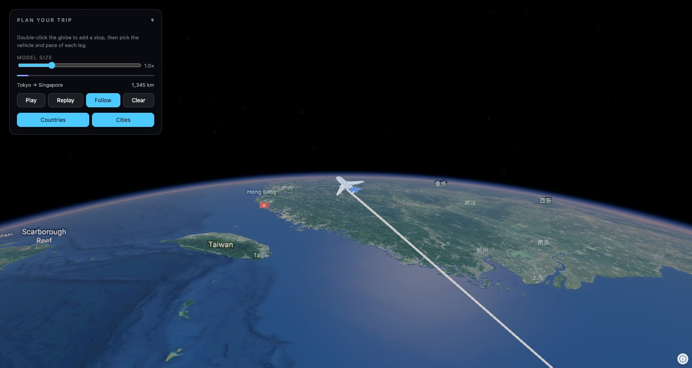

# Travel Route

A TravelBoast-style animated journey on a 3D globe: plan an itinerary, pick how
you travel each leg, and watch a 3D vehicle draw the route as it goes.

Built on [Navara](https://github.com/reearth/navara) — `@navaramap/three`, the
Three.js binding of the Navara globe engine — consumed straight from npm.



## Quick start

```bash
pnpm install     # or npm install / yarn
pnpm dev         # http://localhost:5173
```

Other scripts: `pnpm build` (type-check + production build into `dist/`),
`pnpm preview` (serve that build), `pnpm type-check`, `pnpm format`.

Double-click the globe to append a stop, then choose the vehicle and pace of
each leg in the planner panel.

## Project layout

| File               | What it holds                                                               |
| ------------------ | --------------------------------------------------------------------------- |
| `src/main.ts`      | entry point — creates the `ThreeView` and hands it to `run`                 |
| `src/run.ts`       | the whole scene: layers, labels, vehicle, chase camera, animation loop      |
| `src/itinerary.ts` | route geometry — geodesic legs, cruise arcs, sampling, place lookup         |
| `src/vehicles.ts`  | per-model tuning: scale, nose axis, arc profile, bank/bob, ground clearance |
| `src/labels.ts`    | label font family, declutter priorities, altitude bands, flag emoji         |
| `src/ui.ts`        | the planner panel (plain DOM, no framework)                                 |
| `src/datasets.ts`  | data sources and their attributions                                         |

## What it demonstrates

| Piece                                  | Navara API                                                                            |
| -------------------------------------- | ------------------------------------------------------------------------------------- |
| Leg geometry and distances             | `EllipsoidGeodesic` (`distance`, `interpolateDistance`)                               |
| Vehicle placement on the globe         | `eastNorthUpToFixedFrame` + a mesh `matrixWorld` (see below)                          |
| Vehicle model and its animation        | `GLTFModelDesc` (`animationActiveClip`, live `url` swap per leg)                      |
| Route lines                            | two `SmoothLineMeshDesc` meshes — planned (dashed) and travelled                      |
| Stops, country and city labels         | `geojson` sources + `vector` layers with `billboard` / `text` materials               |
| Label text and flags                   | `FeatureEvaluator.evaluate` + `view.addFontFamily(await fetchFontFamilyFromCss(...))` |
| Relief under the route                 | `quantized-mesh` terrain source, sampled with `view.sampleTerrainHeight`              |
| Adding a stop by pointing at the globe | the view `click` event's ECEF `event.map`                                             |
| Chase camera                           | `view.setCamera({ ..., distance })`                                                   |
| Switching label tiers                  | `view.addLayer` / `layer.delete()` against long-lived sources                         |

## Label tiers

Country and city names are separate layers with their own declutter priority,
and each is switched two ways: a panel toggle, and a camera-altitude band
(`LABEL_ALTITUDE` in `src/labels.ts`) — countries drop out below ~250 km, cities
only appear below ~2 500 km.

Switching a tier **adds or deletes its layer** rather than returning
`show: false` from the evaluator. Re-evaluating every feature to hide it makes
the labels flicker; deleting the layer does not. The sources stay alive
(they're reference counted, and a source only releases its data once no layer
references it), so re-adding a layer restyles cached data instead of refetching.

## Orientation math

Mesh transforms are Cartesian (ECEF), so `position` alone leaves a model lying
on its side. Each frame the vehicle's world matrix is composed as

```
frame · course · UPRIGHT · bank · pitch · noseYaw
```

read right to left, the order vertices travel through:

- `noseYaw` (per vehicle) rotates the model about its own up axis until its nose
  points along +Z, so everything downstream is model-agnostic;
- `pitch` tips it along the flight-path angle of the arc (plus the idle bob);
- `bank` rolls it into the turn;
- `UPRIGHT` stands the Y-up model on the tangent frame;
- `course` swings it onto the current heading;
- `frame` is `eastNorthUpToFixedFrame` at the vehicle's position.

## Build setup notes

The engine ships prebuilt worker chunks and WASM, and fetches some data at
runtime relative to the chunk that runs. Two things in `vite.config.ts` exist
for that and should not be removed casually:

- **`optimizeDeps.exclude`** for the three `@navaramap/*` packages. Dev
  pre-bundling would rewrite their `new URL(..., import.meta.url)` references
  into the dep cache, where the sibling `.wasm` and data files do not exist.
- **`copyNavaraRuntimeAssets`**, which copies the atmosphere/cloud/noise/water
  data directories into `dist/assets/`, and the package's prebuilt worker
  `.wasm` files (notably the font worker's) next to the emitted chunks. Vite
  never sees those references at build time, so nothing else emits them.
  `build.assetsDir` is `"."` so the copied paths line up with the runtime
  lookups.

Known upstream noise: `@navaramap/three@0.0.4` inlines its own copy of Three.js
into the published bundle even though `three` is declared as a peer dependency,
so the console logs `THREE.WARNING: Multiple instances of Three.js being
imported.` Everything renders correctly; the cost is bundle size.

## Data

- Vehicle models: `public/glTF/travel/` — see the `license.txt` there (CC0
  except the plane, which is CC-BY 3.0). The walking figure is three.js'
  `Soldier.glb`.
- `public/data/country-labels.geojson` is derived from the
  [geo-countries](https://github.com/datasets/geo-countries) dataset: one point
  per country at the centroid of its largest ring, so the label layer does not
  have to download the 14 MB polygons.
- City labels come from `public/world-cities.geojson`.
- Both label datasets are also the naming index for double-clicked points: the
  nearest city if one is within ~250 km, otherwise the country the click fell
  in, otherwise an anonymous waypoint with its coordinates. Either way the stop
  keeps the exact position that was clicked — the place only lends its name.
- Terrain is Re:Earth quantized mesh; imagery is EOX Sentinel-2 cloudless.

## Known simplifications

- Legs are geodesics, not real routes: a ship leg crosses land and a train leg
  crosses water if you plan it that way.
- The route lines stay on the ellipsoid; only the vehicle is lifted onto the
  sampled terrain height, which keeps the per-frame cost to one sample.

## License

MIT — see [LICENSE](LICENSE). Bundled 3D models and datasets keep their own
licenses, credited in-app through the Navara attribution UI.
